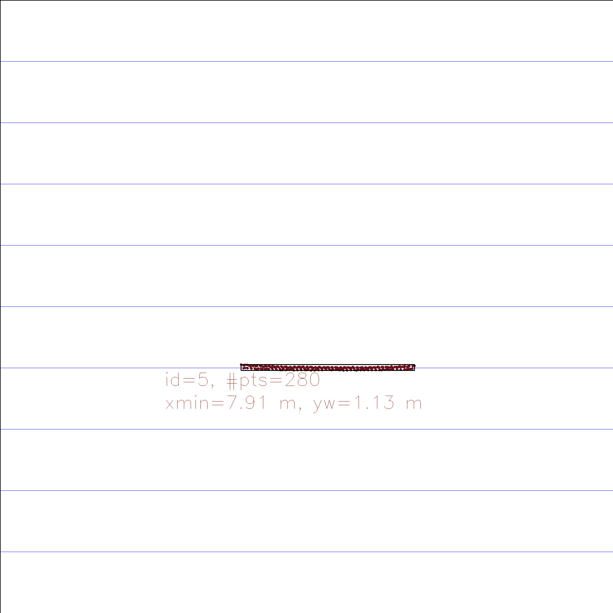
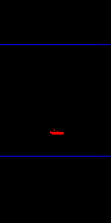
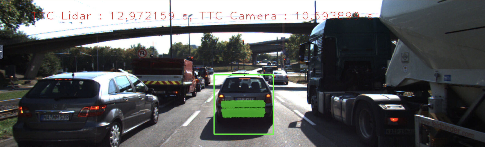

# SFND 3D Object Tracking

Welcome to the final project of the camera course. By completing all the lessons, you now have a solid understanding of keypoint detectors, descriptors, and methods to match them between successive images. Also, you know how to detect objects in an image using the YOLO deep-learning framework. And finally, you know how to associate regions in a camera image with Lidar points in 3D space. Let's take a look at our program schematic to see what we already have accomplished and what's still missing.

In this final project, you will implement the missing parts in the schematic. To do this, you will complete four major tasks: 
1. First, you will develop a way to match 3D objects over time by using keypoint correspondences. 
2. Second, you will compute the TTC based on Lidar measurements. 
3. You will then proceed to do the same using the camera, which requires to first associate keypoint matches to regions of interest and then to compute the TTC based on those matches. 
4. And lastly, you will conduct various tests with the framework. Your goal is to identify the most suitable detector/descriptor combination for TTC estimation and also to search for problems that can lead to faulty measurements by the camera or Lidar sensor. In the last course of this Nanodegree, you will learn about the Kalman filter, which is a great way to combine the two independent TTC measurements into an improved version which is much more reliable than a single sensor alone can be. But before we think about such things, let us focus on your final project in the camera course.  

### FP.1 Match 3D Objects  
We implement the method "matchBoundingBoxes", which takes as input both the previous and the current data frames and provides as output the ids of the matched regions of interest (i.e. the boxID property)“. Matches must be the ones with the highest number of keypoint correspondences.  

camFusion_Student.cpp [line 259](https://github.com/polarbeargo/SFND_3D_Object_Tracking/blob/21e12f93e21be69b61f6474127693df3e10e610d/src/camFusion_Student.cpp#L259) 
### FP.2 Compute Lidar-based TTC    
We compute the time-to-collision in second for all matched 3D objects using only Lidar measurements from the matched bounding boxes between current and previous frame.  
camFusion_Student.cpp [line 227](https://github.com/polarbeargo/SFND_3D_Object_Tracking/blob/21e12f93e21be69b61f6474127693df3e10e610d/src/camFusion_Student.cpp#L227) 

### FP.3 Associate Keypoint Correspondences with Bounding Boxes    
Checking whether the corresponding keypoints are within the region of interest in the camera image. All matches which satisfy this condition should be added to a vector. Compute a robust mean of all the euclidean distances between keypoint matches and then remove those that are too far away from the mean.  

   

camFusion_Student.cpp [line 137](https://github.com/polarbeargo/SFND_3D_Object_Tracking/blob/21e12f93e21be69b61f6474127693df3e10e610d/src/camFusion_Student.cpp#L137)  

### FP.4 Compute Camera-based TTC    
We Compute the time-to-collision in second for all matched 3D objects using only keypoint correspondences from the matched bounding boxes between current and previous frame. 
camFusion_Student.cpp [line 177](https://github.com/polarbeargo/SFND_3D_Object_Tracking/blob/21e12f93e21be69b61f6474127693df3e10e610d/src/camFusion_Student.cpp#L177)  
### FP.5 Performance Evaluation 1  

  
  
  

### FP.6 Performance Evaluation 2   

For 1st and 2nd frame: lidar TTC(s): 12.9721

| Camera TTC(s)           |             |         |             |         |         |         |
| ----------------------- | ----------- | :-----: | :---------: | :-----: | :-----: | :-----: |
| **Detector/Descriptor** | BRISK       |  BRIEF  |     ORB     |  FREAK  |  AKAZE  |  SIFT   |
| SHI-TOMASI              | 119.18      | 16.79   |   15.29     | -3.72   |    X    | 16.15 |
| HARRIS                  | 10.90       | 10.91   |   x         |    x    |    X    | 10.91 |
| FAST                    | 11.98       | 10.6507 |   11.6137   | 11.7545 |    X    |  11.99  |
| BRISK                   | 22.86       | 20.18   | 23.01       | 22.29   |    X    | 29.53   |
| ORB                     | 16.52       | 19.54   |   -inf      | 10.68   |    X    | -0.31 |
| AKAZE                   | 13.16       | 14.99   |   16.73     | 11.6351 | 11.8071 | 12.273  |
| SIFT                    | 22.85       | 11.54   |      X      | 14.76   |    X    | 13.68 | 

## Dependencies for Running Locally
* cmake >= 2.8
  * All OSes: [click here for installation instructions](https://cmake.org/install/)
* make >= 4.1 (Linux, Mac), 3.81 (Windows)
  * Linux: make is installed by default on most Linux distros
  * Mac: [install Xcode command line tools to get make](https://developer.apple.com/xcode/features/)
  * Windows: [Click here for installation instructions](http://gnuwin32.sourceforge.net/packages/make.htm)
* Git LFS
  * Weight files are handled using [LFS](https://git-lfs.github.com/)
  * Install Git LFS before cloning this Repo.
* OpenCV >= 4.1
  * This must be compiled from source using the `-D OPENCV_ENABLE_NONFREE=ON` cmake flag for testing the SIFT and SURF detectors.
  * The OpenCV 4.1.0 source code can be found [here](https://github.com/opencv/opencv/tree/4.1.0)
* gcc/g++ >= 5.4
  * Linux: gcc / g++ is installed by default on most Linux distros
  * Mac: same deal as make - [install Xcode command line tools](https://developer.apple.com/xcode/features/)
  * Windows: recommend using [MinGW](http://www.mingw.org/)

## Basic Build Instructions

1. Clone this repo.
2. Make a build directory in the top level project directory: `mkdir build && cd build`
3. Compile: `cmake .. && make`
4. Run it: `./3D_object_tracking`.
