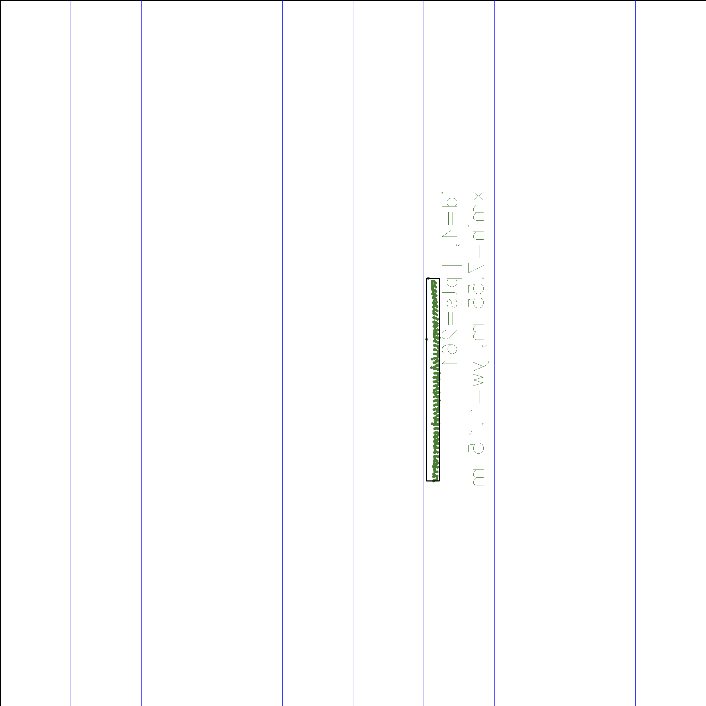

# SFND 3D Object Tracking

Welcome to the final project of the camera course. By completing all the lessons, you now have a solid understanding of keypoint detectors, descriptors, and methods to match them between successive images. Also, you know how to detect objects in an image using the YOLO deep-learning framework. And finally, you know how to associate regions in a camera image with Lidar points in 3D space. Let's take a look at our program schematic to see what we already have accomplished and what's still missing.


In this final project, you will implement the missing parts in the schematic. To do this, you will complete four major tasks: 
1. First, you will develop a way to match 3D objects over time by using keypoint correspondences. 
2. Second, you will compute the TTC based on Lidar measurements. 
3. You will then proceed to do the same using the camera, which requires to first associate keypoint matches to regions of interest and then to compute the TTC based on those matches. 
4. And lastly, you will conduct various tests with the framework. Your goal is to identify the most suitable detector/descriptor combination for TTC estimation and also to search for problems that can lead to faulty measurements by the camera or Lidar sensor. In the last course of this Nanodegree, you will learn about the Kalman filter, which is a great way to combine the two independent TTC measurements into an improved version which is much more reliable than a single sensor alone can be. But before we think about such things, let us focus on your final project in the camera course.  

### FP.1 Match 3D Objects  
We implement the method "matchBoundingBoxes", which takes as input both the previous and the current data frames and provides as output the ids of the matched regions of interest (i.e. the boxID property)“. Matches must be the ones with the highest number of keypoint correspondences. camFusion_Student.cpp [line 270](https://github.com/polarbeargo/SFND_3D_Object_Tracking/blob/5042e1c4bd76740d2f4514f1463f36df761caf50/src/camFusion_Student.cpp#L270) 
### FP.2 Compute Lidar-based TTC    
Using only Lidar readings from the matched bounding boxes between the current and previous frame, we calculate the time-to-collision in seconds for all matched 3D objects.   
camFusion_Student.cpp [line 227](https://github.com/polarbeargo/SFND_3D_Object_Tracking/blob/fa846c002604e33aedb2b8435cda5b764dc3a105/src/camFusion_Student.cpp#L227) 

### FP.3 Associate Keypoint Correspondences with Bounding Boxes    
Determining whether the relevant keypoints are present in the relevant area of the captured image. Any matches that meet this requirement ought to be added to a vector. The euclidean distances between all of the keypoint matches should be averaged robustly, and any that deviate too far from the mean should be eliminated.

   

camFusion_Student.cpp [line 137](https://github.com/polarbeargo/SFND_3D_Object_Tracking/blob/fa846c002604e33aedb2b8435cda5b764dc3a105/src/camFusion_Student.cpp#L137)  

### FP.4 Compute Camera-based TTC    
Using just keypoint correspondences from the matched bounding boxes between the current and previous frame, we compute the time-to-collision in seconds for all matched 3D objects. camFusion_Student.cpp [line 177](https://github.com/polarbeargo/SFND_3D_Object_Tracking/blob/21e12f93e21be69b61f6474127693df3e10e610d/src/camFusion_Student.cpp#L177)  

### FP.5 Performance Evaluation 1  

Find examples where the TTC estimate of the Lidar sensor does not seem plausible. Describe your observations and provide a sound argumentation why you think this happened.
When the lidar returns some spots that are obviously not on the vehicle but are much closer than that, the Lidar TTC estimate becomes implausible. The noise in the lidar scans may be caused by airborne dust particles. A extremely low TTC is the end outcome. By using an average distance rather than the nearest point, we may correct this problem and become more resilient to outliers. There are outliers caused by the lidar scanning the vehicle's other surfaces in addition to its back surface, which is another instance of an unreliable Lidar TTC estimate. For instance, the side mirrors, which appear to be considerably farther away than the real back of the car, are being measured by the lidar. Mismatching distances between vehicles, especially during breaking frames. The distance between decelerating cars is often found to be increasing instead of decreasing.
  
  

### FP.6 Performance Evaluation 2   
Run a variety of detector/descriptor combinations and compare the TTC estimation results. Determine which techniques work best and provide various instances when camera-based TTC prediction is wildly inaccurate. Recap your observations and consider possible causes, much like with Lidar.  
The following lines of code are what the -inf is supposed to be. Because the distribution of the keypoints may not meet the distance criterion, the list of distance ratios is not empty.
```
if (distRatios.size() == 0)
{
  TTC = NAN;
  return;
}
```  
For our aim of identifying keypoints on cars, the TOP 3 detector / descriptor combinations are: 
 
| TOP 3 detector / descriptor |
| -------------- |
|   FAST/ BRIEF  |
|   FAST/ ORB    |
|   FAST/ FREAK  |
[Spreadsheet](./src/run_3d_tracking.csv)
## Dependencies for Running Locally
* cmake >= 2.8
  * All OSes: [click here for installation instructions](https://cmake.org/install/)
* make >= 4.1 (Linux, Mac), 3.81 (Windows)
  * Linux: make is installed by default on most Linux distros
  * Mac: [install Xcode command line tools to get make](https://developer.apple.com/xcode/features/)
  * Windows: [Click here for installation instructions](http://gnuwin32.sourceforge.net/packages/make.htm)
* Git LFS
  * Weight files are handled using [LFS](https://git-lfs.github.com/)
  * Install Git LFS before cloning this Repo.
* OpenCV >= 4.1
  * This must be compiled from source using the `-D OPENCV_ENABLE_NONFREE=ON` cmake flag for testing the SIFT and SURF detectors.
  * The OpenCV 4.1.0 source code can be found [here](https://github.com/opencv/opencv/tree/4.1.0)
* gcc/g++ >= 5.4
  * Linux: gcc / g++ is installed by default on most Linux distros
  * Mac: same deal as make - [install Xcode command line tools](https://developer.apple.com/xcode/features/)
  * Windows: recommend using [MinGW](http://www.mingw.org/)

## Basic Build Instructions

1. Clone this repo.
2. Make a build directory in the top level project directory: `mkdir build && cd build`
3. Compile: `cmake .. && make`
4. Run it: `./3D_object_tracking`.
